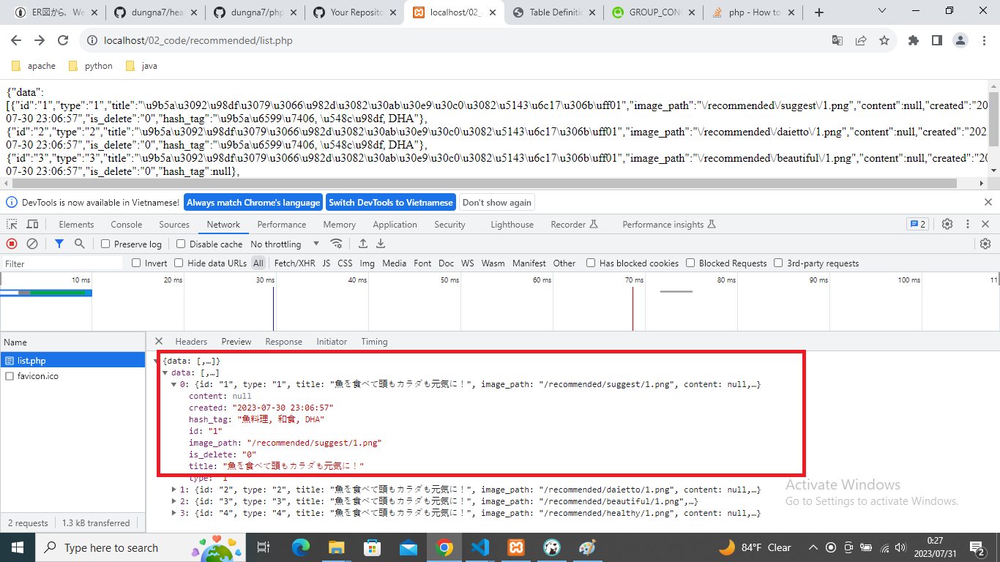

# php_web_api
step 1 : clone source code  
-------
  - clone source code về máy,đặt tại thư mục root của xamp  

step 2 : SETUP THE DATABASE
-------
  - sử dụng phpmyadmin, tạo database 'healthy'  
  - sau đó chọn tệp healthy.sql import vào database 'healthy'.   
  - hoặc có thể chạy trực tiếp lệnh sql trong file healthy.sql   

step 3 :config môi trường
-------
  - mở file data_config.php  
  - sửa lại username và password của mysql cho chuẩn  
    [đoạn code sau :  
      private $host = "localhost";  
      private $db_name = "healthy";  
      private $username = "root";  
      private $password = " ";  
    ]  

step 4 : chạy thử 
-------
  - chạy xamp và start apache và mysql lên  
  - truy cập các linh sau trên trình duyệt để kiểm tra kết quả lấy thông tin người sử dụng.   
    http://localhost/02_code/recommended/list.php  
    
    chú ý : sửa localhost thành ServerName của bạn   
  - sử dụng postman hoặc 1 tool nào đó ..... gửi 1 post request tới link sau để thực hiện new a recode  
    http://localhost/02_code/user/create.php với data là :  
      [  
      "email" => "an12@gmail.com",  
      "name" => "an",  
      "permision" => "1",  
      ]
  - sử dụng postman hoặc 1 tool nào đó ..... gửi 1 post request tới link sau để thực hiện update:  
    http://localhost/02_code/user/update.php?id=1 với data là :  
      [  
      "name" => "an",  
      "permision" => "2",  
      ]
