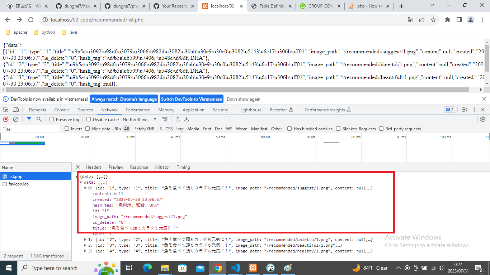

# healthy
  api for healthy app

# 1.systemに必要なtable、必要なapiのresponse jsonデータ、それぞれのつながりを図に
まとめてください

## databse -> mysql
        entities : 01_doc/entities/index.html
        sql file : 01_doc/healthy.sql
        ERD : 01_doc/healthy.a5er    open by A5 SQL

## API 仕様
        01_doc/API.xlsx
        recommended list API 作成した,それ以外はまだです。
        その他APIはI列で実装工数を見積もりします。

# 2.systemのbackend の開発を行ってください
## 開発環境
  - 言語は、・PHP
  - database : mysql
  - local server : xampp
  - source : 02_code
## recommended list API 実装しました。

   - 環境設定出来たら、以下のURLで確認できます。
    http://localhost/02_code/recommended/list.php 

   
   - それ以外は未実装です。

### 短く時間で仕様を理解不足こともございますと思いますが、上記の物を作りました。
不明点など、追加で要求されるが有ればご連絡をお願い致します。

